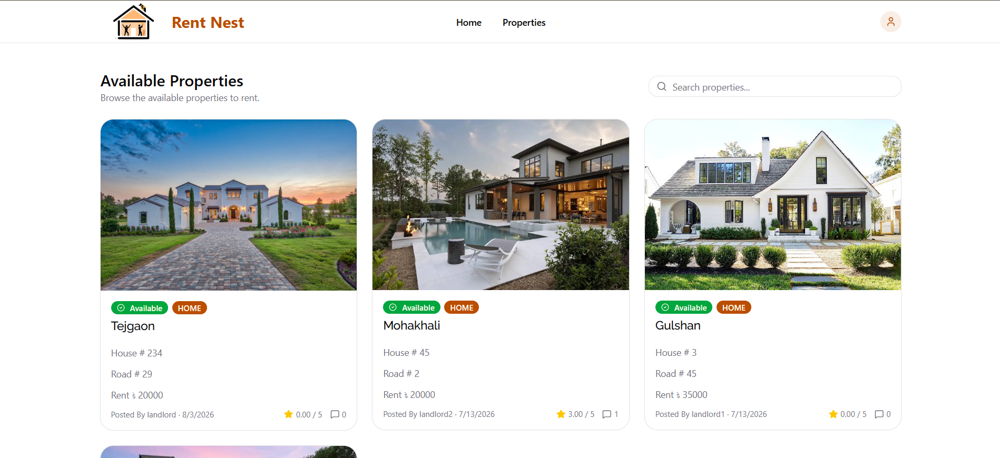
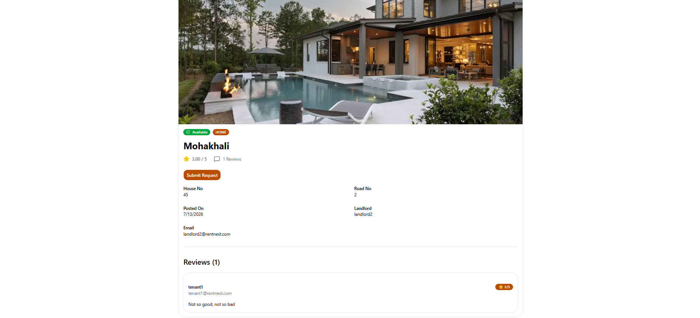

# 🚀 RentNest Frontend

<div align="center">


[](https://github.com/AlNahianFatin/RentNest_Frontend/stargazers)

[](https://github.com/AlNahianFatin/RentNest_Frontend/network)

[](https://github.com/AlNahianFatin/RentNest_Frontend/issues)


**A modern and intuitive user interface for seamless rental property management.**


[Backend Repo](https://github.com/AlNahianFatin/RentNest_Backend)
[Live Demo](https://rentnestfrontend.vercel.app)

</div>

## 📖 Overview

RentNest Frontend serves as the user-facing application for the RentNest platform, providing a clean, responsive, and highly interactive experience for managing rental properties. Built with cutting-edge web technologies, it allows users to browse listings, search for specific properties, view detailed information, and interact with the RentNest backend API for all property-related operations. This project focuses on delivering a robust and user-friendly interface to streamline the rental process for both tenants and property owners.

## ✨ Features

-   🎯 **Property Browsing & Search**: Efficiently discover rental properties with advanced search and filtering capabilities.
-   📋 **Detailed Property Listings**: View comprehensive information for each property, including descriptions, amenities, and media.
-   🔐 **User Authentication**: Secure user login and registration to access personalized features.
-   👤 **User Management**: Manage user profiles, saved properties, and rental applications (inferred).
-   📱 **Responsive Design**: Optimized for a seamless experience across various devices and screen sizes.
-   🎨 **Modern UI Components**: Utilizes a set of beautifully crafted and accessible UI components for a consistent look and feel.
-   🔄 **API Integration**: Seamless communication with a dedicated backend API to fetch and manage data.

## 🖥️ Screenshots

### Property Listing



### Property Details



## 🛠️ Tech Stack

**Frontend:**


**DevOps & Tools:**


## 🚀 Quick Start

Follow these steps to get the RentNest Frontend up and running on your local machine.

### Prerequisites
Before you begin, ensure you have the following installed:
-   **Node.js**: `^18.17.0` or newer (as per common Next.js requirements)
-   **npm**: `^9.6.7` or newer

### Installation

1.  **Clone the repository**
    ```bash
    git clone https://github.com/AlNahianFatin/RentNest_Frontend.git
    cd RentNest_Frontend
    ```

2.  **Install dependencies**
    ```bash
    npm install
    ```

3.  **Environment setup**
    Create a `.env` file in the root of the project by copying the example:
    ```bash
    cp .env.example .env
    ```
    Open `.env` and configure your environment variables. The primary variable required for connecting to the backend is:
    ```ini
    NEXT_PUBLIC_BASE_API_URL="http://localhost:8000/api" # Replace with your backend API URL
    ```
    **Note**: The value for `NEXT_PUBLIC_BASE_API_URL` should point to your RentNest backend service.

4.  **Start development server**
    ```bash
    npm run dev
    ```

5.  **Open your browser**
    Visit `http://localhost:3000` to see the application running.

## 📁 Project Structure

```
RentNest_Frontend/
├── .env.example             # Example environment variables
├── .gitignore               # Files ignored by Git
├── app/                     # Next.js App Router for pages and routes
│   ├── (auth)/              # Authentication-related routes/pages (inferred)
│   ├── (root)/              # Main application routes/pages (inferred)
│   └── layout.tsx           # Root layout component
├── components.json          # Shadcn UI components configuration
├── components/              # Reusable UI components
│   ├── ui/                  # Shadcn UI primitive components
│   └── [other-components]/  # Application-specific components
├── eslint.config.mjs        # ESLint configuration
├── hooks/                   # Custom React hooks
├── lib/                     # Client-side utility libraries/helpers
├── next.config.ts           # Next.js configuration
├── package.json             # Project metadata and scripts
├── package-lock.json        # npm dependency lock file
├── postcss.config.mjs       # PostCSS configuration (for Tailwind CSS)
├── proxy.ts                 # API proxy configuration or types
├── public/                  # Static assets (images, fonts, etc.)
├── service/                 # Client-side services for API interaction
├── tsconfig.json            # TypeScript configuration
└── utils/                   # General utility functions
```

## ⚙️ Configuration

### Environment Variables
The application relies on environment variables for sensitive data and configuration. A `.env.example` file is provided as a template.

| Variable             | Description                                     | Default | Required |

|----------------------|-------------------------------------------------|---------|----------|

| `BACKEND_API_URL` | Base URL of the RentNest backend API endpoint. | None | Yes |

| `JWT_ACCESS_SECRET` | JWT secret to verify JWT authentication. | None | Yes |

| `JWT_REFRESH_SECRET` | JWT refresh secret to recreate JWT access token. | None | Yes |

### Configuration Files
-   `next.config.ts`: Main configuration file for Next.js.
-   `postcss.config.mjs`: Configures PostCSS, typically used for Tailwind CSS processing.
-   `eslint.config.mjs`: Configures ESLint for code quality and style checking.
-   `tsconfig.json`: TypeScript compiler options for the project.
-   `components.json`: Configuration for Shadcn UI components.

## 🔧 Development

### Available Scripts
In the project directory, you can run the following commands:

| Command         | Description                                     |

|-----------------|-------------------------------------------------|

| `npm run dev`   | Starts the development server at `http://localhost:3000`. |

| `npm run build` | Builds the application for production to the `.next` folder. |

| `npm run start` | Starts a production-ready server after building the application. |

| `npm run lint`  | Runs ESLint to check for code quality and style issues. |

### Development Workflow
Changes made to the source code will trigger a hot reload in the development server. Ensure all code adheres to ESLint rules by running `npm run lint` before committing.

## 🧪 Testing

This project does not currently have explicit automated test configurations (e.g., Jest, React Testing Library) detected. Testing efforts are currently focused on manual verification and component-level inspection.

To add testing:
```bash

```

## 🚀 Deployment

### Production Build
To create an optimized production build of the application:
```bash
npm run build
```
This will generate the production build files in the `.next` directory.

### Deployment Options
The RentNest Frontend, being a Next.js application, can be easily deployed to various platforms:
-   **Vercel**: Recommended for Next.js applications, offering seamless integration and automatic deployments.
-   **Netlify**: Another popular choice for static and server-rendered sites.
-   **Docker**: A `Dockerfile` can be created to containerize the application for deployment on container orchestration platforms like Kubernetes or any cloud provider supporting Docker.
-   **Traditional Hosting**: The generated `.next` folder can be served by a Node.js server or other compatible hosting environments after `npm run build`.

## 📚 API Integration

This frontend application interacts with a separate backend API to perform its operations. The `service/` directory contains client-side logic for making API requests, and `proxy.ts` used for defining API endpoints or handling request configurations.

Ensure your backend API is running and accessible at the URL specified in your `BACKEND_API_URL` environment variable.

## 🤝 Contributing

We welcome contributions to the RentNest Frontend! Please follow these guidelines:

1.  Fork the repository.
2.  Create a new branch for your feature or bug fix.
3.  Make your changes and ensure they adhere to the project's coding standards (run `npm run lint`).
4.  Commit your changes with clear, descriptive messages.
5.  Push your branch and open a pull request.

For more detailed information, please refer to our [Contributing Guide](CONTRIBUTING.md).

### Development Setup for Contributors
The development setup is identical to the Quick Start guide. Ensure you have Node.js and npm installed, and configure your `.env` file to point to the appropriate backend API.

## 📄 License

This project is not currently covered by an explicit license. Please contact the repository owner for licensing information. 

## 🙏 Acknowledgments

-   **Next.js** for the powerful React framework.
-   **React** for building interactive user interfaces.
-   **Tailwind CSS** for an efficient utility-first CSS framework.
-   **Shadcn UI** for beautiful and accessible UI components.
-   **ESLint** for maintaining code quality.
-   **AlNahianFatin** for initiating and maintaining this project.

## 📞 Support & Contact

-   🐛 Issues: [GitHub Issues](https://github.com/AlNahianFatin/RentNest_Frontend/issues)
-   📧 Email: [fatinnahian@gmail.com](mailto:fatinnahian@gmail.com) 

---

<div align="center">

**⭐ Star this repo if you find it helpful!**

Made with ❤️ by [AlNahianFatin](https://github.com/AlNahianFatin)

</div>

